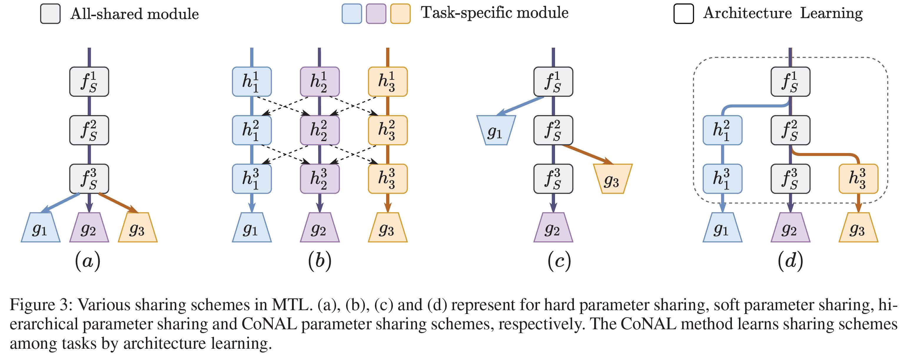
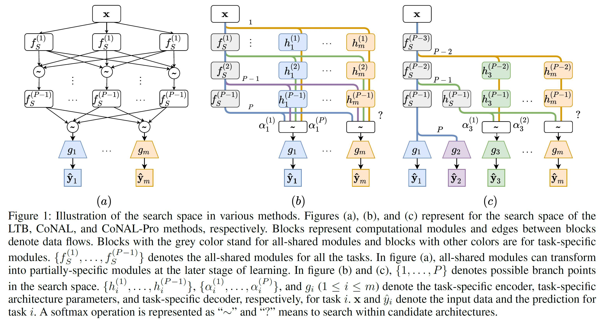

# CoNAL: Learning Conflict-Noticed Architecture for Multi-Task Learning

This repository includes the pytorch implementation of "[Learning Conflict-Noticed Architecture for Multi-Task Learning](https://yuezhixiong.github.io/Papers/CoNAL.pdf)".



## Citation

If you find ``CoNAL`` useful for research or development, please cite our paper:

```latex
@article{CoNAL,
  title={Learning Conflict-Noticed Architecture for Multi-Task Learning},
  author={Zhixiong Yue, Yu Zhang, Jie Liang},
  journal={Proceedings of the 2023 National Conference of the American Association for Artificial Intelligence (AAAI2023)},
  year={2023}
}
```

## Setup Environment

Please install following python packages:
```
- python
- numpy
- pytorch
- torchvision
- tensorboard
```
or install from requirements:
```
pip install -r requirements.txt
```

## Example Usage

Learn MTL architecture in NYUv2 dataset:
```
python CoNAL/train.py
```
Then retrain the learned architecture:
```
python CoNAL/retrain.py
```

## Visualization
We use tensorboard to visualize the architecture learning process
```
tensorboard --logdir logs/logdir
```
The learned architecture can be found in ```logs/logdir/arch.json```

